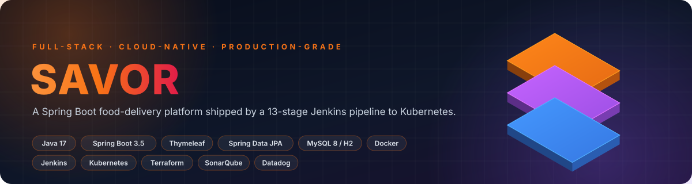
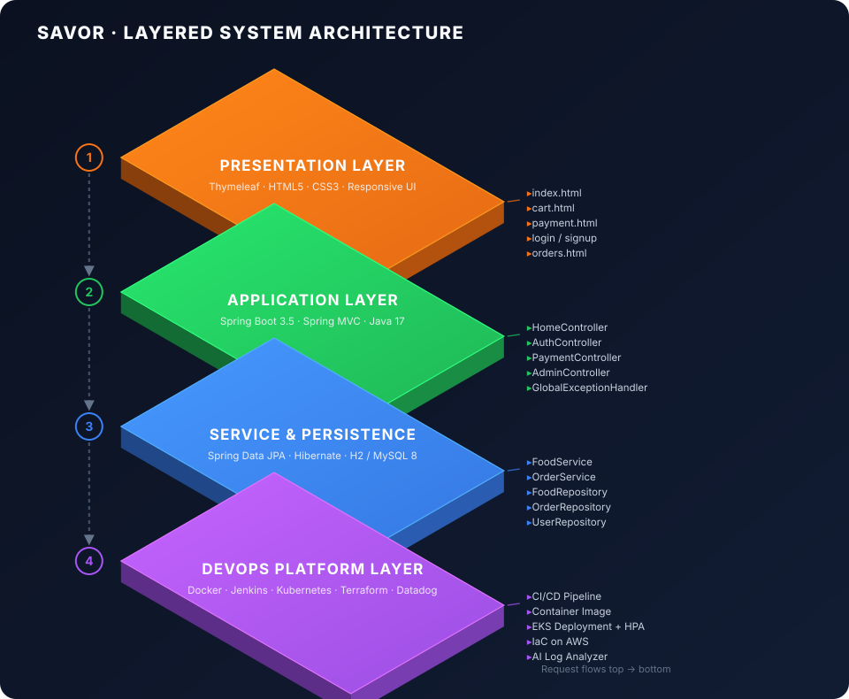
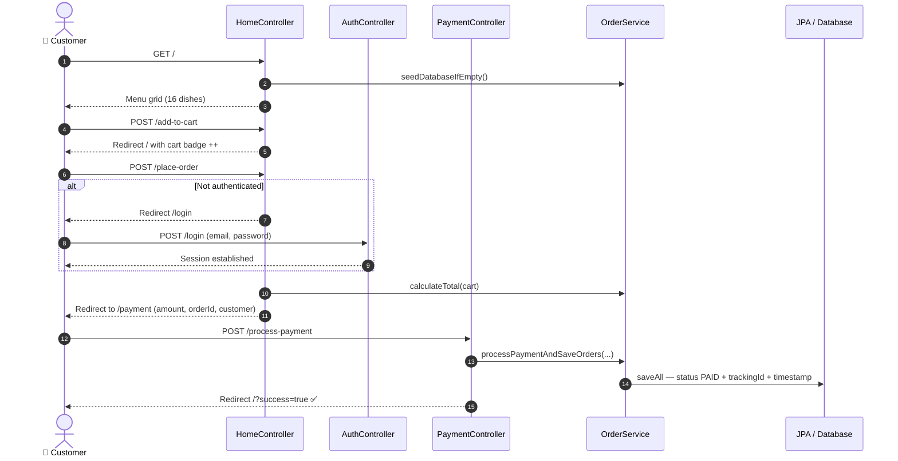
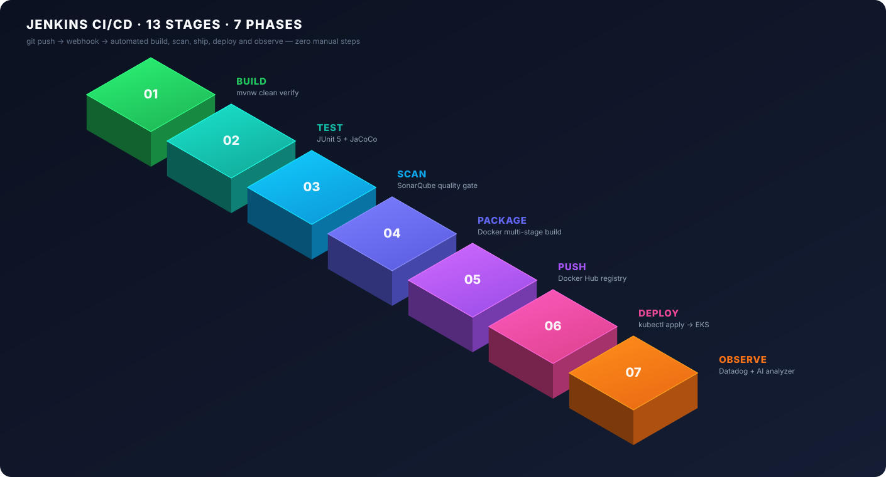

<div align="center">



<br>

[](https://openjdk.org/projects/jdk/17/)
[](https://spring.io/projects/spring-boot)
[](https://www.docker.com/)
[](https://kubernetes.io/)
[](https://www.jenkins.io/)
[](https://www.terraform.io/)
[](https://www.datadoghq.com/)
[](https://www.sonarsource.com/)

**A production-shaped food ordering platform — not just a CRUD demo.**
Browse a menu → build a cart → authenticate → pay → track the order in an admin console.
Then watch the whole thing build, scan, containerize, deploy and self-diagnose through an automated pipeline.

<a href="#-quick-start"><b>Quick Start</b></a> &nbsp;·&nbsp;
<a href="#-architecture"><b>Architecture</b></a> &nbsp;·&nbsp;
<a href="#-cicd-pipeline"><b>CI/CD</b></a> &nbsp;·&nbsp;
<a href="#-api-surface"><b>Routes</b></a> &nbsp;·&nbsp;
<a href="#-engineering-decisions"><b>Decisions</b></a>

</div>

---

## 📌 What this project is

**Savor** is a full-stack, server-rendered food delivery web application built on **Spring Boot 3.5 + Java 17**, wrapped in a complete **cloud-native delivery pipeline**.

Most portfolio projects stop at "it runs on my laptop." This one goes the whole distance:

| Layer | What was built |
|:--|:--|
| 🍽️ **Product** | Menu catalogue, session cart, auth, simulated payment gateway, admin order console |
| ⚙️ **Backend** | Layered Spring MVC — Controller → Service → Repository → Entity, with global exception handling |
| 💾 **Data** | Spring Data JPA / Hibernate, H2 in-memory for dev, MySQL 8 for containerized runs |
| 🐳 **Containerization** | Multi-stage Dockerfile (build image ≠ runtime image) → slim JRE Alpine runtime |
| ☸️ **Orchestration** | Kubernetes Deployment with RollingUpdate, readiness/liveness probes, HPA (2→8 pods), NLB Service |
| 🔁 **CI/CD** | 13-stage Jenkins declarative pipeline: build → test → scan → package → push → deploy → verify → notify |
| 📡 **Observability** | Datadog Operator manifest — APM auto-instrumentation, cluster checks, full log collection |
| 🤖 **AIOps** | Custom Python incident analyzer that pattern-matches failures and emits root-cause + fix + prevention |
| 🏗️ **IaC** | Terraform module scaffolding for AWS provisioning |
| 🔍 **Code quality** | SonarQube static analysis + JaCoCo coverage reporting wired into the build |

---

## 🏛️ Architecture

A strict four-layer design — every layer talks only to the one directly beneath it.

<div align="center">

</div>

### Request lifecycle — placing an order



### Data model

```mermaid
erDiagram
    USERS {
        bigint id PK
        varchar name
        varchar email UK
        varchar password
    }
    FOOD_ITEM {
        bigint id PK
        varchar name
        double price
        varchar image_url
    }
    CUSTOMER_ORDER {
        bigint id PK
        varchar item_name
        double price
        int quantity
        varchar image_url
        varchar customer_name
        varchar order_status
        varchar tracking_id
        datetime order_time
    }

    USERS ||--o{ CUSTOMER_ORDER : "places"
    FOOD_ITEM ||--o{ CUSTOMER_ORDER : "snapshotted into"
```



> **Design note:** `CUSTOMER_ORDER` deliberately stores a *price snapshot* rather than a foreign key to `FOOD_ITEM`. If the restaurant raises a price tomorrow, historical invoices stay truthful — the same pattern real e-commerce systems use for line items.

---

## ✨ Features

<table>
<tr>
<td width="50%" valign="top">

### 🛒 Customer experience
- **Rich menu** — 16 curated dishes across Indian, Italian, Asian, fast food and dessert categories, auto-seeded on first boot
- **Live cart badge** — item count reflected in the navbar on every page
- **Session-backed auth** — signup, login, logout with duplicate-email protection and auto-login after registration
- **Auth-gated checkout** — anonymous users are bounced to `/login`, then returned to flow
- **Simulated payment gateway** — dedicated confirmation screen with UUID transaction reference
- **Success feedback** — post-payment confirmation banner rendered back on the home page

</td>
<td width="50%" valign="top">

### 🛠️ Operations & platform
- **Admin console** — `/admin/orders` lists every paid order, newest first
- **Order provenance** — customer name, status, tracking ID and timestamp persisted per line item
- **Self-healing pods** — readiness + liveness probes on `/actuator/health`
- **Zero-downtime deploys** — `maxUnavailable: 0`, `maxSurge: 1` rolling strategy
- **Autoscaling** — HPA scales 2→8 replicas at 70% CPU
- **AI incident triage** — pipeline failures are parsed into root cause, fix command and prevention advice
- **Email notifications** — success/failure build reports sent from the pipeline

</td>
</tr>
</table>

---

## 🚀 CI/CD Pipeline

Every `git push` triggers a fully automated path to production. No manual steps.

```mermaid
flowchart LR
    A["git push"] --> B["Jenkins webhook"]
    B --> C["mvnw clean verify"]
    C --> D["JUnit 5 + JaCoCo"]
    D --> E{"SonarQube<br/>quality gate"}
    E -- pass --> F["Docker multi-stage build"]
    E -- fail --> X["❌ Build stopped<br/>AI report + email"]
    F --> G["Push to Docker Hub"]
    G --> H["kubectl apply<br/>deployment + service"]
    H --> I["Verify rollout<br/>pods · svc · HPA"]
    I --> J["Datadog agent check"]
    J --> K["AI log analyzer"]
    K --> L["Deployment event → Datadog"]
    L --> M["✅ Success email"]

    style A fill:#1e293b,stroke:#64748b,color:#f8fafc
    style E fill:#0ea5e9,stroke:#0369a1,color:#ffffff
    style X fill:#be123c,stroke:#881337,color:#ffffff
    style M fill:#15803d,stroke:#166534,color:#ffffff
```

<div align="center">

</div>



<details>
<summary><b>📋 All 13 stages, in order</b></summary>

| # | Stage | Purpose |
|:-:|:--|:--|
| 1 | Clone Code | Pull `main` branch |
| 2 | Clean Workspace | `mvnw clean` — remove stale artifacts |
| 3 | Build Application | `mvnw clean verify` — compile + package |
| 4 | Run Tests | Execute the JUnit 5 suite |
| 5 | SonarQube Analysis | Static analysis against the quality gate |
| 6 | Build Docker Image | Tag with `v${BUILD_NUMBER}` **and** `latest` |
| 7 | Docker Login | Authenticate via Jenkins credential store |
| 8 | Push Docker Image | Publish both tags to the registry |
| 9 | Kubernetes Deploy | Apply Deployment + Service manifests |
| 10 | Verify Deployment | `kubectl rollout status` gate |
| 11 | Verify Monitoring | Confirm Datadog agent pods + `kubectl top` |
| 12 | AI Monitoring Analysis | Run `ai-monitor/log_analyzer.py` |
| 13 | Datadog Event | POST a deployment marker to the Datadog Events API |

**Post-build:** success → detailed HTML build report email. Failure → AI analyzer runs *again* and a diagnostic email with recommended actions is dispatched.

</details>

### 🤖 The AI incident analyzer

`ai-monitor/log_analyzer.py` is a lightweight, dependency-free triage engine. It scans logs for known Kubernetes failure signatures and produces a structured incident report instead of a raw stack trace:

| Detected signature | Root cause it reports | Fix it suggests |
|:--|:--|:--|
| `OOMKilled` | Pod exceeded its memory limit | Raise `limits.memory` to `1Gi` |
| `CrashLoopBackOff` | Container dies on startup | `kubectl logs <pod> --previous` |
| `ImagePullBackOff` | Registry auth / bad image name | Verify Docker credentials + image tag |
| `ConnectionRefused` | Downstream service unreachable | Check MySQL service + `DB_HOST` |
| `OutOfMemory` | JVM heap exhausted | Add `-Xmx512m` to the entrypoint |
| `Pending` | Node has insufficient resources | Scale the node group / enable Cluster Autoscaler |

Each match emits **root cause → fix → prevention**, saved to `ai-monitor/ai-report.txt` and echoed into the Jenkins console.

---

## ⚡ Quick Start

### Prerequisites

`Java 17+` · `Maven` (wrapper included) · `Docker` *(optional)* · `kubectl` *(optional)*

### Option 1 — Run locally (fastest, zero config)

```bash
git clone https://github.com/tejaswipolanati20/fooddeliveryapp1.git
cd fooddeliveryapp1

./mvnw spring-boot:run          # macOS / Linux
mvnw.cmd spring-boot:run        # Windows
```

Open **http://localhost:8080** — the menu seeds itself automatically on first request.

| Endpoint | URL |
|:--|:--|
| 🏠 Storefront | http://localhost:8080/ |
| 🛒 Cart | http://localhost:8080/cart |
| 🔐 Sign up | http://localhost:8080/signup |
| 📊 Admin orders | http://localhost:8080/admin/orders |
| 🗄️ H2 console | http://localhost:8080/h2-console &nbsp;·&nbsp; JDBC `jdbc:h2:mem:testdb` · user `sa` · no password |

### Option 2 — Docker

```bash
docker build -t fooddeliveryapp .
docker run -p 8080:8080 fooddeliveryapp
```

The image is built in two stages — Maven + JDK 17 compiles the jar, then only the artifact is copied into an `eclipse-temurin:17-jre-alpine` runtime. Final image carries no build toolchain.

### Option 3 — Docker Compose (with MySQL)

```bash
docker compose up -d
```

| Service | Host port |
|:--|:--|
| App | `8082` → 8080 |
| MySQL 8 (`fooddb`) | `3307` → 3306 |

### Option 4 — Kubernetes

```bash
kubectl apply -f src/main/resources/k8s/deployment.yaml
kubectl apply -f src/main/resources/k8s/service.yaml

kubectl rollout status deployment/fooddelivery-deployment
kubectl get svc fooddelivery-service        # grab the LoadBalancer host
```

Ships with 2 replicas, CPU/memory requests + limits, health probes, an HPA to 8 pods, and an AWS NLB Service with cross-zone load balancing enabled.

---

## 🧭 API Surface

| Method | Route | Auth | Description |
|:--|:--|:-:|:--|
| `GET` | `/` | — | Menu grid, cart badge, success banner |
| `POST` | `/add-to-cart` | — | Add an item (name, price, imageUrl) to the cart |
| `GET` | `/cart` | — | Cart contents + computed total |
| `POST` | `/place-order` | ✅ | Validates session, redirects to the payment gateway |
| `GET` | `/payment` | ✅ | Payment screen for `orderId` · `amount` · `customerName` |
| `POST` | `/process-payment` | ✅ | Persists orders as `PAID`, clears the cart |
| `GET` `POST` | `/signup` | — | Registration with unique-email guard + auto-login |
| `GET` `POST` | `/login` | — | Session authentication |
| `GET` | `/logout` | ✅ | Invalidates the session |
| `GET` | `/admin/orders` | — | All orders, newest first |
| `GET` | `/h2-console` | — | Dev-only database console |

---

## 📂 Project Structure

```
fooddeliveryapp1/
│
├── src/main/java/com/example/
│   ├── demo/
│   │   └── FoodDeliveryAppApplication.java   # Entry point + CommandLineRunner seeder
│   ├── controller/
│   │   ├── HomeController.java               # Menu, cart, checkout initiation
│   │   ├── AuthController.java               # Signup / login / logout
│   │   ├── PaymentController.java            # Gateway simulation + order persistence
│   │   └── AdminController.java              # Order console
│   ├── service/
│   │   ├── FoodService.java                  # Catalogue + idempotent seeding
│   │   └── OrderService.java                 # Total calculation, payment finalisation
│   ├── repository/                           # Spring Data JPA interfaces
│   ├── model/                                # User · FoodItem · Order entities
│   ├── dto/CheckoutRequestDTO.java           # Checkout payload
│   └── exception/GlobalExceptionHandler.java # @ControllerAdvice catch-all
│
├── src/main/resources/
│   ├── templates/          # Thymeleaf: index · cart · payment · login · signup · orders
│   ├── static/css/         # 507-line custom design system (no CSS framework)
│   ├── k8s/                # Deployment + HPA + LoadBalancer Service
│   └── application.properties
│
├── src/test/java/          # JUnit 5 suite
├── ai-monitor/             # Python AIOps incident analyzer
├── monitoring/             # Datadog Operator manifest (APM · logs · cluster checks)
├── terraform/              # AWS IaC — provider, variables, outputs
│
├── Jenkinsfile             # 13-stage declarative pipeline
├── Dockerfile              # Multi-stage build
├── docker-compose.yml      # App + MySQL 8
├── sonar-project.properties
└── pom.xml
```

---

## ⚙️ Configuration

Default profile runs entirely in memory — clone and go, no database install required.

```properties
spring.datasource.url=jdbc:h2:mem:testdb
spring.jpa.hibernate.ddl-auto=update
spring.h2.console.enabled=true
server.port=8080
```

<details>
<summary><b>Switching to MySQL</b></summary>

```properties
spring.datasource.url=jdbc:mysql://localhost:3307/fooddb
spring.datasource.username=root
spring.datasource.password=root
spring.jpa.database-platform=org.hibernate.dialect.MySQL8Dialect
spring.jpa.hibernate.ddl-auto=update
```

The MySQL connector is already on the classpath — only these properties change.

</details>

<details>
<summary><b>Jenkins credentials required</b></summary>

| Credential ID | Type | Used for |
|:--|:--|:--|
| `tokenofsonar` | Secret text | SonarQube authentication |
| `dockercred1` | Username + password | Docker registry push |
| `DATADOG_API_KEY` | Secret text | Deployment event API |

No secret is ever committed — all values resolve from the Jenkins credential store at runtime.

</details>

---

## 🧠 Engineering Decisions

> The reasoning behind the choices, not just the choices.

**Multi-stage Docker over a fat single stage.** The build stage carries Maven and a full JDK; the runtime stage carries only a JRE and the jar. Smaller attack surface, faster pulls, no compiler shipped to production.

**Price snapshotting on order lines.** Storing the price at purchase time rather than joining to the live menu means historical orders remain accurate after a menu repricing — the same trade-off real invoicing systems make.

**Idempotent seeding with a guard.** `seedDatabaseIfEmpty()` checks the row count before writing, so restarts and repeat requests never duplicate the catalogue — important because the H2 profile starts from an empty schema on every boot.

**Probes on `/actuator/health`, not the root path.** A liveness probe on `/` would keep a pod alive whenever Thymeleaf renders, even with a broken data layer. A dedicated health endpoint fails honestly.

**`maxUnavailable: 0` in the rolling strategy.** Capacity never dips below the desired replica count during a deploy, so releases are invisible to customers.

**Failure path runs the analyzer *before* the email.** The failure notification carries a diagnosis rather than a link to logs, so the first responder starts with a hypothesis instead of a search.

---

## 🗺️ Roadmap

Known limitations, stated openly — each is a deliberate scoping decision for the current phase, with the intended fix noted.

| Area | Current state | Planned |
|:--|:--|:--|
| Password storage | Plaintext for demo simplicity | Spring Security + BCrypt hashing |
| Authorization | Session attribute checks in controllers | Spring Security filter chain, `ROLE_ADMIN` on `/admin/**` |
| Cart persistence | In-memory list on the controller bean | Spring Session or a `cart` table keyed by user |
| Payments | Simulated gateway with UUID references | Razorpay / Stripe integration with webhook confirmation |
| Test suite | Smoke + arithmetic tests | `@WebMvcTest` slices, Testcontainers for the JPA layer |
| Terraform | Provider, variables and outputs scaffolded; `main.tf` pending | Full VPC + EKS cluster + node group definition |
| Order status | Binary `PENDING` / `PAID` | Full lifecycle: `PREPARING → OUT_FOR_DELIVERY → DELIVERED` with live tracking |

---

## 🧪 Tech Stack

<div align="center">

| Domain | Technologies |
|:--|:--|
| **Language & Runtime** | Java 17 · JVM |
| **Framework** | Spring Boot 3.5.13 · Spring MVC · Spring Data JPA · Spring DevTools |
| **View** | Thymeleaf · HTML5 · Custom CSS design system · Font Awesome |
| **Persistence** | Hibernate · H2 (dev) · MySQL 8 (container) |
| **Build & Quality** | Maven Wrapper · JUnit 5 · JaCoCo · SonarQube · Lombok |
| **Containers & Orchestration** | Docker (multi-stage) · Docker Compose · Kubernetes · HPA · AWS NLB |
| **CI/CD & IaC** | Jenkins (declarative) · Terraform · Docker Hub |
| **Observability** | Datadog Operator · APM auto-instrumentation · Log collection · Custom Python AIOps |

</div>

---

## 🤝 Contributing

```bash
git checkout -b feature/your-feature
git commit -m "feat: add your feature"
git push origin feature/your-feature
```

Then open a pull request. Issues and suggestions are equally welcome.

---

<div align="center">

### 👩‍💻 Author

**Tejaswi Polanati**

[](https://github.com/tejaswipolanati20)

<br>

**If this project taught you something, a ⭐ would mean a lot.**

<sub>Built with Spring Boot · Shipped with Jenkins · Scaled on Kubernetes · Watched by Datadog</sub>

</div>
